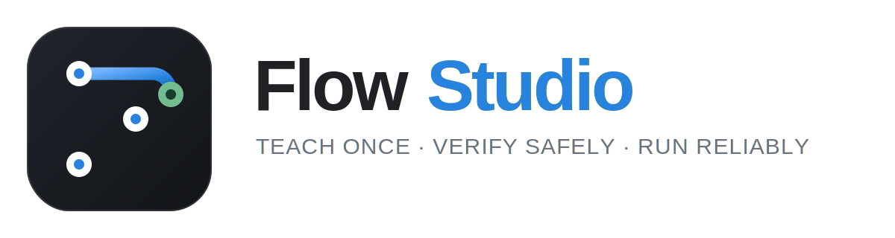
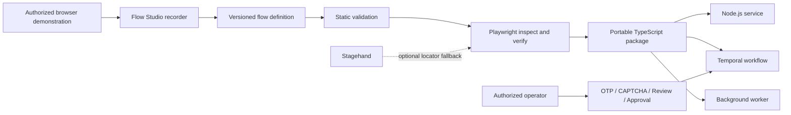

Record browser workflows, turn them into versioned state machines, verify them with Playwright, and export durable automation runners.

<!--
  Flow Studio README
  Before publishing:
  1. Replace YOUR_GITHUB_USERNAME in the Community section.
  2. Add docs/assets/flow-studio-demo.gif and uncomment the demo block.
  3. Confirm the repository license and update the License section if needed.
-->

<div align="center">



<br />
# Flow Studio

<p><strong>Teach once. Verify safely. Run reliably.</strong></p>

**A local, open-source authoring studio that turns browser demonstrations into versioned, testable, resumable Playwright workflows.**

[Quick start](#quick-start) · [How it works](#how-it-works) · [Flow format](#flow-format) · [Durable execution](#durable-pause-and-resume) · [Safety](#safety-by-design) · [Contributing](#contributing)

</div>

---

## Why Flow Studio?

Browser recorders are fast to start but often produce brittle, linear scripts. A successful click does not prove that the portal accepted an action, raw selectors break when markup changes, and human steps such as OTP, CAPTCHA, review, or approval are difficult to model safely.

Flow Studio records an authorized browser demonstration and converts it into an explicit state machine with semantic targets, assertions, retries, branches, human checkpoints, and guarded submission. The resulting workflow can be inspected visually, verified locally, versioned immutably, and exported as a self-contained TypeScript package.

> Flow Studio is not an autonomous decision-maker. Applicant data, authorization, browser lifecycle, document storage, and irreversible approvals remain under the control of the host application and an authorized person.

## What makes it different?

| Traditional recorder                  | Flow Studio                                          |
| ------------------------------------- | ---------------------------------------------------- |
| Linear generated script               | Explicit, versioned state machine                    |
| Raw or positional selectors           | Semantic Playwright locators                         |
| A click is treated as success         | Post-action assertions prove outcomes                |
| Restarts from the beginning           | Serializable checkpoints and resume                  |
| Human steps are ad hoc                | OTP, CAPTCHA, login, payment, and approval contracts |
| Submission can be replayed            | Guarded submission with `never_replay` semantics     |
| Runtime tied to the authoring product | Portable TypeScript runner                           |
| AI may control the workflow           | AI is an optional locator fallback only              |

## Highlights

### Visual authoring

- Record a legitimate browser workflow in a dedicated Chrome profile.
- Convert navigation and actions into page states and semantic steps.
- Edit, add, move, or delete steps after recording.
- Model fields, documents, assertions, transitions, branches, and repeats.
- Validate the graph and safety rules before execution.
- Finalize immutable versions with SHA-256 checksums.

### Reliable execution

- Resolve deterministic Playwright locators before any AI fallback.
- Require every resolved target to match exactly one visible element.
- Detect the active page state before executing its steps.
- Apply preconditions, bounded retries, and success/failure assertions.
- Protect pre-populated values with configurable existing-value policies.
- Capture screenshots, traces, event logs, and download artifacts.

### Human-in-the-loop automation

- Pause for OTP, CAPTCHA, authentication, document review, or payment.
- Require explicit approval before irreversible submission.
- Resume local runs using a process-local `HumanGate`.
- Resume distributed runs using serializable checkpoints and one-time tokens.
- Integrate durable pauses with Temporal or another workflow engine.

### Portable output

Export a self-contained TypeScript package with:

- `runApplicationFlowUntilPause()` for durable, multi-worker execution.
- `runApplicationFlow()` for uninterrupted integrations.
- Strict flow, checkpoint, document, and intervention schemas.
- Playwright-first target resolution.
- Optional Stagehand locator fallback.
- Callbacks for checkpoints, human intervention, evidence, and logs.

## How it works



1. **Record** an authorized workflow in Chrome.
2. **Generate** a draft YAML or JSON flow.
3. **Review** the state canvas and semantic steps.
4. **Validate** schema, graph, target references, assertions, and safety rules.
5. **Inspect** target resolution without performing normal actions.
6. **Verify** reversible actions while final submission remains blocked.
7. **Publish** a warning-free immutable flow version.
8. **Export** a portable runner for the host application.

## Requirements

- Node.js 20 or newer
- npm
- Chrome or Chromium
- macOS, Windows, or Linux

> The desktop application uses Electron. Local browser execution uses Playwright and a persistent Chrome profile.

## Quick start

### 1. Clone and install

```bash
git clone https://github.com/YOUR_GITHUB_USERNAME/flow-studio.git
cd flow-studio
npm install
```

### 2. Launch the desktop studio

```bash
npm run desktop
```

This builds the TypeScript project and starts the Electron application.

### 3. Run the included mock portal

In a separate terminal:

```bash
npm run mock
```

The mock portal is designed for safe end-to-end testing of navigation, pre-populated fields, uploads, downloads, retries, OTP pauses, manual verification, approval, and blocked final submission.

### 4. Validate the installation

```bash
npm run typecheck
npm test
```

## Desktop workflow

### Record

1. Open Flow Studio.
2. Create or select a draft flow.
3. Enter the portal entry URL.
4. Keep **Capture entered values locally** disabled unless local plaintext capture is explicitly required.
5. Start recording and complete the authorized demonstration in Chrome.
6. Stop recording and generate the draft.

### Review and edit

Use the desktop editor to:

- Review fields and document requirements.
- Inspect states and their success transitions.
- Select steps directly from the state canvas.
- Add a safe manual step.
- Edit the complete JSON representation of a step.
- Move a step to another state.
- Delete obsolete steps.
- Repair validation errors before testing.

### Validate and test

- **Run checks** performs schema, graph, reference, and safety validation.
- **Inspect** resolves and highlights targets without normal interactions.
- **Validate & test** runs static validation and then opens Chrome in `verify` mode.
- **Open browser & run flow** starts executable verification directly.
- **Stop test** terminates the active local run.

Verify mode executes permitted actions and assertions but always blocks final submission.

## CLI

```text
record <url>             Record a manual browser demonstration
generate <events.jsonl>  Convert recorded events into a draft flow
validate <flow.yaml>     Run schema, graph, reference, and safety checks
run <flow.yaml>          Execute in inspect, verify, or submit mode
publish <flow.yaml>      Finalize an immutable flow version
export <flow.yaml>       Generate a portable TypeScript package
mock --port 4173         Start the included local mock portal
```

### Record a demonstration

```bash
npm run record -- https://example.com/application
```

### Generate a draft

```bash
npm run generate -- recordings/<recording>/events.jsonl
```

### Validate a flow

```bash
npm run validate -- flows/drafts/<flow>.yaml
```

### Inspect targets safely

```bash
npm run run -- flows/drafts/<flow>.yaml \
  --mode inspect \
  --step-by-step
```

Inspect mode resolves and highlights semantic targets without performing normal workflow actions.

### Verify reversible actions

```bash
npm run run -- flows/drafts/<flow>.yaml \
  --data test-data/private/input.json \
  --mode verify
```

Verify mode performs allowed actions and assertions but stops before final submission.

### Export a portable package

```bash
npm run export -- flows/drafts/<flow>.yaml \
  --output exports/<flow>

cd exports/<flow>
npm install
npm run typecheck
```

## Flow format

Flows are versioned YAML or JSON documents validated with Zod.

```yaml
version: 1

application:
  key: example-application
  title: Example Application
  entryUrl: https://example.com/apply

fields:
  - key: full_name
    label: Full name
    type: text
    required: true
    sensitive: false

documents: []

flow:
  initialState: applicant_details
  entryStates:
    - applicant_details
    - dashboard
  terminalStates:
    - completed
    - manual_review

states:
  applicant_details:
    detection:
      urlIncludes: /apply
      visibleText:
        - Applicant details

    steps:
      - id: fill_name
        type: fill
        field: full_name
        mode: fill_if_empty
        target:
          labels:
            - Full name
        successAssertions:
          - type: field_value
            target:
              labels:
                - Full name
            value: "{{fields.full_name}}"

      - id: continue
        type: click
        target:
          roles:
            - role: button
              name: Continue
        successAssertions:
          - type: url
            includes: /review

    transitions:
      success: review

  review:
    recoveryPolicy: detect_and_continue
    detection:
      urlIncludes: /review
      visibleText:
        - Review application

    steps:
      - id: approve_submission
        type: human_approval
        prompt: Review the application before submission

      - id: submit_application
        type: submit
        recoveryPolicy: never_replay
        target:
          roles:
            - role: button
              name: Submit application

    transitions:
      success: completed

  completed:
    detection:
      visibleText:
        - Application submitted
    steps: []
```

## Supported step types

| Category              | Step types                                             |
| --------------------- | ------------------------------------------------------ |
| Navigation and checks | `navigate`, `assert_page`, `wait_for`                  |
| Form interactions     | `fill`, `date`, `select`, `checkbox`, `radio`, `click` |
| Files and data        | `upload`, `download`, `extract`, `capture_evidence`    |
| Control flow          | `branch`, `repeat`                                     |
| Human checkpoints     | `human_input`, `human_approval`, `payment`             |
| Irreversible action   | `submit`                                               |

Every interactive step can define preconditions, success/failure assertions, retry behavior, and sensitivity metadata.

## Target resolution

Flow Studio tries deterministic strategies in this order:

1. Test ID
2. Accessible role and name
3. Label
4. Name attribute
5. Placeholder
6. Visible text
7. CSS fallback
8. Optional Stagehand observation

A candidate is accepted only when it resolves to exactly one visible element. Stagehand can help locate a control when deterministic strategies fail, but it cannot choose applicant data, make policy decisions, or approve an irreversible action.

## Existing-value protection

Text, date, and select steps support these write modes:

| Mode            | Behavior                                                          |
| --------------- | ----------------------------------------------------------------- |
| `fill_if_empty` | Preserve a non-empty website value and fill only an empty control |
| `replace`       | Always replace the current value                                  |
| `preserve`      | Never change the current value                                    |
| `append`        | Append input to the existing text                                 |

For reused browser sessions, `existingValuePolicy` can be set to:

- `trust_existing`
- `require_match`
- `manual_review_on_mismatch`

Sensitive identity fields should normally use `require_match` or `manual_review_on_mismatch`.

## Document uploads

Each upload step refers to a logical document key rather than embedding a local path in the flow definition.

```yaml
- id: upload_identity
  type: upload
  document: identity_pdf
  mode: replace
  target:
    labels:
      - Upload identity document
  successAssertions:
    - type: element
      target:
        text:
          - identity.pdf
      state: visible
```

Runtime documents can be supplied as local paths or in-memory Playwright payloads:

```typescript
type RuntimeDocument =
  | string
  | string[]
  | { name: string; mimeType: string; buffer: Buffer }
  | Array<{ name: string; mimeType: string; buffer: Buffer }>;
```

Document definitions can constrain multiplicity, MIME types, extensions, and maximum size. Completing `setInputFiles()` alone is never considered proof that the portal accepted the upload; every upload requires a post-upload assertion.

## Durable pause and resume

`runApplicationFlowUntilPause()` is the primary production API for Temporal and multi-worker systems. It returns instead of holding a worker open when human intervention is required.

```typescript
import { runApplicationFlowUntilPause } from "./generated-flow/src/index.js";

const result = await runApplicationFlowUntilPause({
  page,
  input: applicantData,
  documents,
  checkpoint,
  interventionResponse,
  browserSessionId,
  allowSubmit: false,
  callbacks: {
    onCheckpoint: (event) => jobs.saveCheckpoint(jobId, event),
    onHumanIntervention: (request) => jobs.saveIntervention(jobId, request),
    onHumanState: (event) => jobs.saveHumanState(jobId, event),
    onEvidence: (artifact) => evidenceStore.put(jobId, artifact),
    onLog: (event) => logger.info(event),
  },
});
```

Each invocation returns one of:

- `paused` — includes a serializable checkpoint and intervention request.
- `completed` — includes the terminal state and non-sensitive extracted values.
- `failed` — includes a checkpoint and serializable error.

### Checkpoint guarantees

A checkpoint can preserve:

- Run, flow, state, and next-step identity.
- Completed step instances.
- Non-sensitive extracted values.
- Branch decisions and repeat positions.
- Retry counters and assertion results.
- Consumed intervention tokens.
- Browser-session identity.
- A sanitized page URL without query or fragment.
- Submission approval, intent, idempotency key, and proven result reference.

A checkpoint never stores applicant input, OTP values, document buffers, storage credentials, or URL query parameters.

### Resume-token semantics

- Tokens contain cryptographically secure randomness and no applicant data.
- Tokens are bound to the run, immutable flow checksum, state, and step.
- Tokens expire and are consumed by resume or cancellation.
- Duplicate authorized signals are handled idempotently.
- Cancellation is terminal and prevents a later resume.

### Browser restart policies

| Policy                | Behavior                                                |
| --------------------- | ------------------------------------------------------- |
| `detect_and_continue` | Continue only after detecting a declared page state     |
| `restart_state`       | Continue from an explicitly declared safe restart state |
| `manual_only`         | Return a manual-fallback failure instead of replaying   |
| `never_replay`        | Never reconstruct or repeat the state automatically     |

Final-submit states and submit steps must use `never_replay`. If execution stops after the click but before success is proven, the result is an unknown-outcome failure rather than a second click.

## Temporal integration pattern

A durable host workflow should:

1. Acquire one active execution lease for the application.
2. Launch or reconnect to the browser session.
3. Call `runApplicationFlowUntilPause()` in a bounded browser activity.
4. Persist the returned checkpoint before processing the result.
5. On `paused`, persist the intervention request and return from the activity.
6. Wait for an authenticated Temporal signal or equivalent event.
7. Start a new activity with the checkpoint and validated response.
8. Never blindly retry an irreversible or unknown-outcome action.
9. Persist the terminal checkpoint and close the execution lease.

## Generated runner integration

The host application owns browser lifecycle, applicant data, private document storage, job persistence, authorization, and the human-intervention interface. The generated package owns semantic flow execution.

```typescript
import { HumanGate, runApplicationFlow } from "./generated-flow/src/index.js";

const gate = new HumanGate();

const result = await runApplicationFlow({
  page,
  input: applicantData,
  documents: {
    identity_pdf: "/secure/jobs/job-123/identity.pdf",
    applicant_photo: {
      name: "photo.jpg",
      mimeType: "image/jpeg",
      buffer: photoBuffer,
    },
  },
  stagehand, // Optional locator fallback only
  allowSubmit: false,
  callbacks: {
    onCheckpoint: (event) => jobs.saveCheckpoint(jobId, event),
    onHumanIntervention: (request) => gate.wait(request),
    onHumanState: (event) => jobs.saveHumanState(jobId, event),
    onEvidence: (artifact) => evidenceStore.put(jobId, artifact),
  },
});
```

`HumanGate` is process-local and intended for local or uninterrupted integrations. Use the checkpoint-returning API for restarts, distributed workers, or durable orchestration.

## Safety by design

Flow Studio is designed for authorized browser workflows and supervised irreversible actions.

### Recording

- Entered values are redacted when local value capture is disabled.
- Explicitly captured values are stored as local plaintext.
- Recordings, private test input, browser profiles, cookies, and document mappings must never be committed or shared.

### Execution modes

| Mode      | Behavior                                                              |
| --------- | --------------------------------------------------------------------- |
| `inspect` | Resolves and highlights targets without normal actions                |
| `verify`  | Executes permitted actions and assertions but blocks final submission |
| `submit`  | Permits submission only after multiple explicit safeguards            |

Submit mode requires:

- `--allow-final-submit`
- A prior approval step
- Typed application-key confirmation
- Runtime `allowSubmit` authorization in generated packages

### Responsible use

- Use Flow Studio only on systems you own or are authorized to operate.
- Do not use it to bypass authentication, CAPTCHA, rate limits, or access controls.
- CAPTCHA and portal verification must be completed by an authorized person.
- Do not use Stagehand or another model to invent applicant data or authorize submission.
- Follow the target website's terms, applicable laws, data-protection requirements, and organizational policies.
- Keep production secrets and personal data outside the flow definition and source repository.

## Verification checklist

Before publishing or deploying a flow:

- [ ] Static validation returns `VALID`.
- [ ] TypeScript compilation and unit tests pass.
- [ ] Inspect mode highlights the intended unique target for every step.
- [ ] Verify mode reaches the expected terminal state without submitting.
- [ ] Assertions detect intentionally incorrect pages and values.
- [ ] Logged-in and logged-out entry states are both detected when applicable.
- [ ] Pre-populated values are protected by the intended policy.
- [ ] Required documents upload from private test fixtures.
- [ ] OTP resumes with a validated runtime value.
- [ ] CAPTCHA and human verification pause for an authorized operator.
- [ ] The generated package compiles independently.
- [ ] Deterministic Playwright resolution succeeds without Stagehand.
- [ ] Stagehand fallback is tested separately in a controlled case.
- [ ] Final submission remains blocked during verification.

## Project structure

```text
flow-studio/
├── desktop/                # Electron main, preload, and renderer
├── flows/
│   ├── drafts/             # Editable flow definitions
│   └── published/          # Immutable finalized versions
├── mock-portal/            # Local integration-test portal
├── recordings/             # Local recorder artifacts
├── src/
│   ├── executor/           # State detection and step execution
│   ├── generator/          # Draft and portable-package generation
│   ├── publisher/          # Immutable version publishing
│   ├── recorder/           # Browser event recording
│   ├── schema/             # Zod flow schemas
│   └── validator/          # Graph, reference, and safety checks
├── test-data/private/      # Local-only inputs and document mappings
├── tests/                  # Automated tests
└── exports/                # Generated portable packages
```

## Development

```bash
# Compile TypeScript
npm run build

# Type-check without emitting files
npm run typecheck

# Run the test suite
npm test

# Start the Electron application
npm run desktop

# Start the mock portal
npm run mock
```

### Design principles for contributions

1. Prefer deterministic Playwright behavior over probabilistic automation.
2. Require evidence that an action succeeded.
3. Preserve human control over identity, authorization, and irreversible actions.
4. Keep checkpoints serializable, minimal, and free of sensitive values.
5. Never replay an action when its previous outcome is unknown.
6. Keep exported runners independent of the Flow Studio desktop runtime.
7. Maintain backward compatibility for public runner APIs where practical.

## Troubleshooting

### A target resolves to multiple elements

Add a stronger test ID, role/name pair, label, frame constraint, or narrowly scoped CSS fallback. Flow Studio intentionally rejects ambiguous locators.

### Verify mode stops before submission

This is expected. Verify mode always blocks final submission. Use it to validate navigation, data entry, uploads, assertions, and terminal-state detection safely.

### The recorder produced redacted values

Value redaction is the safe default. Provide private runtime input through `test-data/private` or the generated runner instead of storing personal data in the flow definition.

### A workflow cannot resume after a process restart

`HumanGate` is process-local. Use `runApplicationFlowUntilPause()`, persist the returned checkpoint, retain or reconnect to the browser session, and resume from a new worker activity.

### An exported package does not compile

Run the following inside the exported directory and inspect the first TypeScript error:

```bash
npm install
npm run typecheck
```

Also verify that the source flow passes validation and that the export was regenerated after the latest schema change.

## Roadmap

High-impact directions include:

- Cross-platform packaged desktop releases.
- Reusable flow fragments and templates.
- Import assistance for existing Playwright scripts.
- Browserbase and Browserless session adapters.
- Expanded Firefox and WebKit verification.
- External checkpoint-store examples.
- Visual flow-diff and migration tooling.
- Reliability benchmarks against controlled browser-task suites.

Roadmap items are proposals, not commitments. Open an issue before starting a large change.

## Contributing

Contributions are welcome.

1. Fork the repository.
2. Create a focused branch.
3. Add or update tests for behavior changes.
4. Run `npm run typecheck` and `npm test`.
5. Ensure no recordings, cookies, credentials, personal data, or private documents are included.
6. Open a pull request describing the problem, approach, safety impact, and verification performed.

For large features or schema changes, open an issue first so the design can be discussed before implementation.

## Security

Do not report security vulnerabilities in a public issue. Use GitHub's private vulnerability reporting feature when enabled, or contact the repository owner privately.

Never attach:

- Credentials or session cookies
- Browser profiles
- Applicant or customer data
- OTP or verification values
- Private documents or document paths
- Unredacted recordings, traces, screenshots, or logs

When reporting a non-sensitive bug, include the operating system, Node.js version, sanitized validation output, expected behavior, and minimal reproduction steps.

## Community

- Use [GitHub Discussions](https://github.com/YOUR_GITHUB_USERNAME/flow-studio/discussions) for questions and design proposals.
- Use [GitHub Issues](https://github.com/YOUR_GITHUB_USERNAME/flow-studio/issues) for reproducible bugs and scoped feature requests.
- Review open issues labeled `good first issue` for contributor-friendly tasks.

## License

Add a repository license before public release. Apache-2.0 is a strong default for a developer tool because it includes an explicit patent grant; MIT is a simpler permissive alternative.

---

<div align="center">

**Teach once. Verify safely. Run reliably.**

Built for developers who need browser automation that can be inspected, tested, resumed, and trusted.

</div>
